# Tarea 1 - LAMP en Ubuntu

## 1. Servidor Web Apache

Instalar el servicio apache

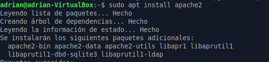

Para comprobar que funciona hay que ir al navegador y poner **http://localhost**

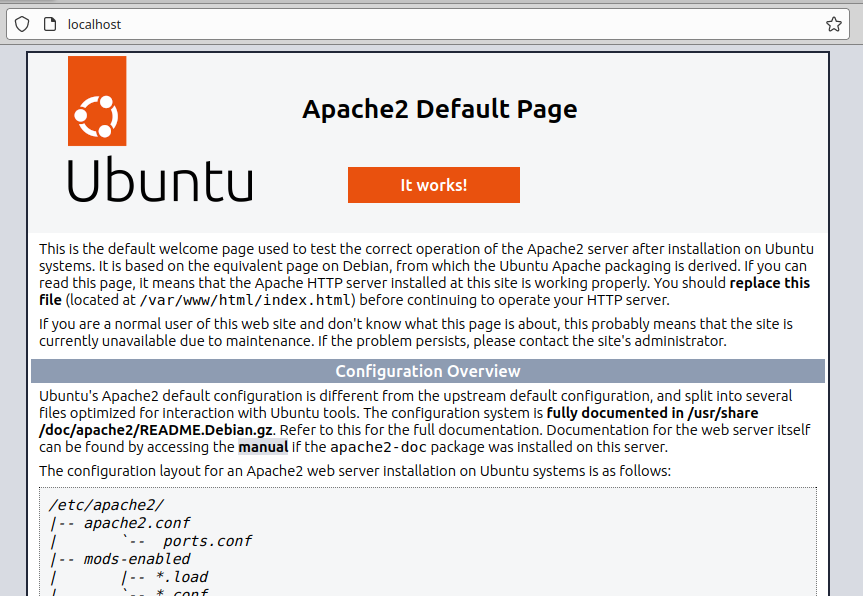

esto mostrará la pagina por defecto de apache

## 2. MySql

Instalar el servicio mysql

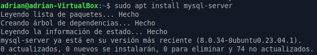

Luego entramos en mysql como root

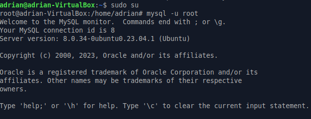

Ahora crear una base de datos y con una tabla y insertar algunos datos

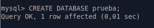

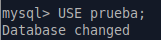

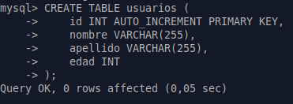

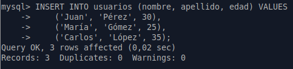

Comprobar que se han insertado datos en la tabla

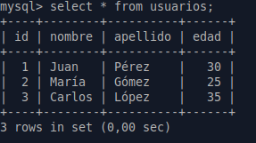

Aqui he creado el nuevo usuario al que le he otorgado todos los privilegios 

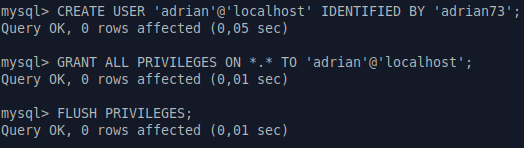

## 3. Php

Instalar PHP 

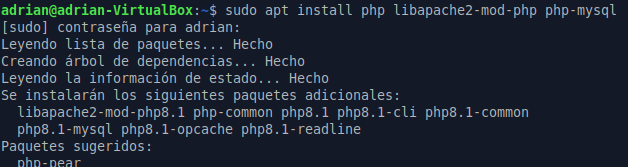

Una vez instalado en en la ruta **/var/www/html** creas el archivo **info.php**

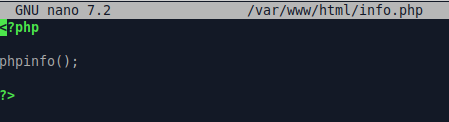

Esto mostrará en el navegador lo siguiente poniendo **http://tu_IP/info.php**

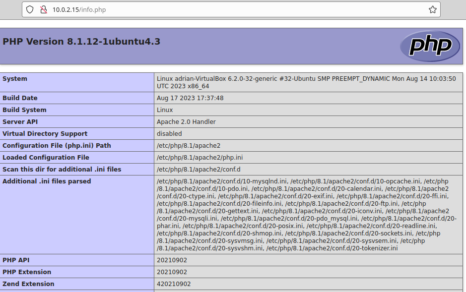

Ahora hay que crear otro .php el cual contendrá una conexion a la base de datos y haga una consulta

a mi no me funcionó con localhost en la parte de **$servidor** y tuve que poner la IP **127.0.0.1**

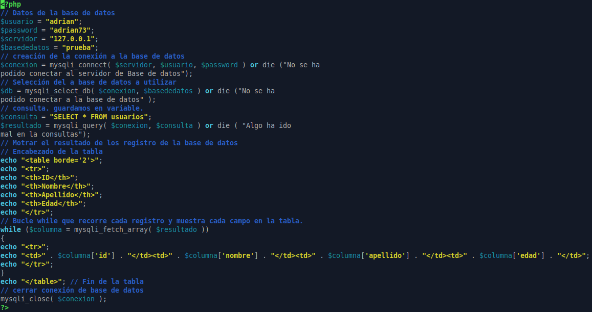

Una vez lo tienes hecho y modificado a tu gusto, vas al navegador y pones **http://localhost/nombre_del_php**

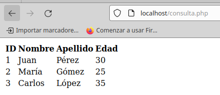

Aqui mostrará la consulta

## 4. Gestor web de Base de datos

### PHPMYADMIN

Instalar phpmyadmin

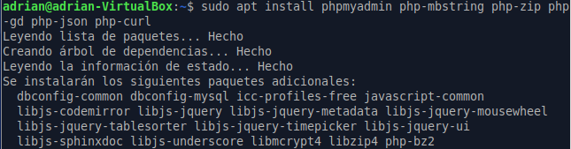

Al instalar tendremos que comprobar en el fichero **apache2.conf** de la ruta **/etc/apache2** que la siguiente linea existe, sino hay que añadirla

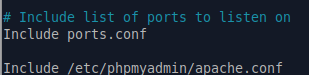

Vamos al navegador y ponemos **http://localhost/phpmyadmin** y te enviará al login de phpmyadmin

### ADMINER

Instalar adminer

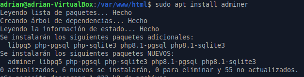

Creamos un enlace simbolico desde las rutas especificadas en la imagen y reiniciamos servicio

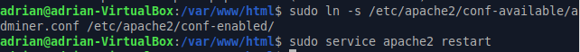

Vamos al navegador y ponemos **http://localhost/adminer**, esto llevará a un login y cuando entremos saldrá lo siguiente:

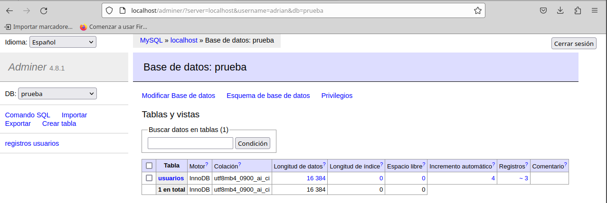

## 5. Analizar los logs de Apache

Instalar GoAccess

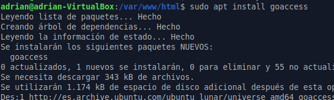

El siguiente comando lo que hará es entrar al log de apache y darle un formato de fecha para poder entrar

Al ejecutar el comando entrarás en el panel de control de goaccess y podrás ver todos los logs de apache

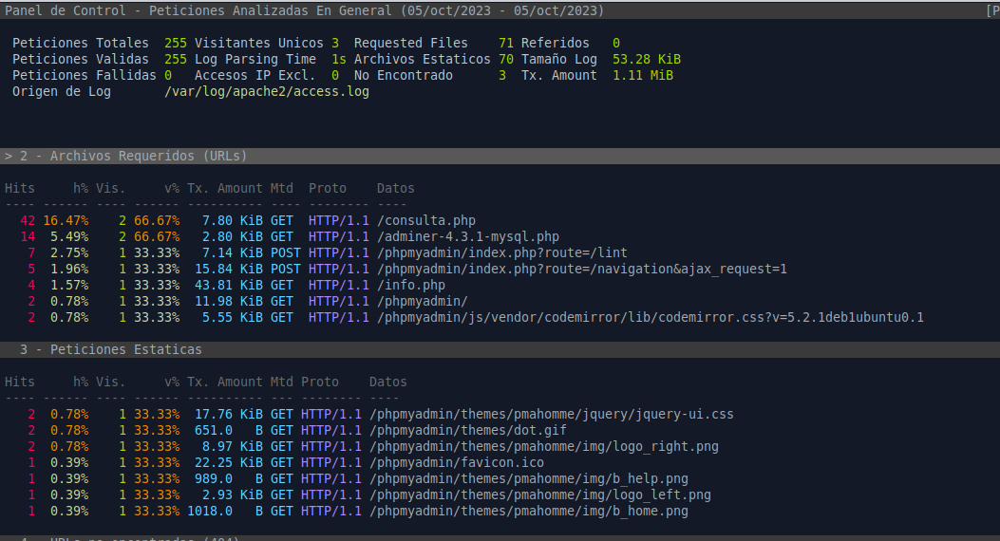

